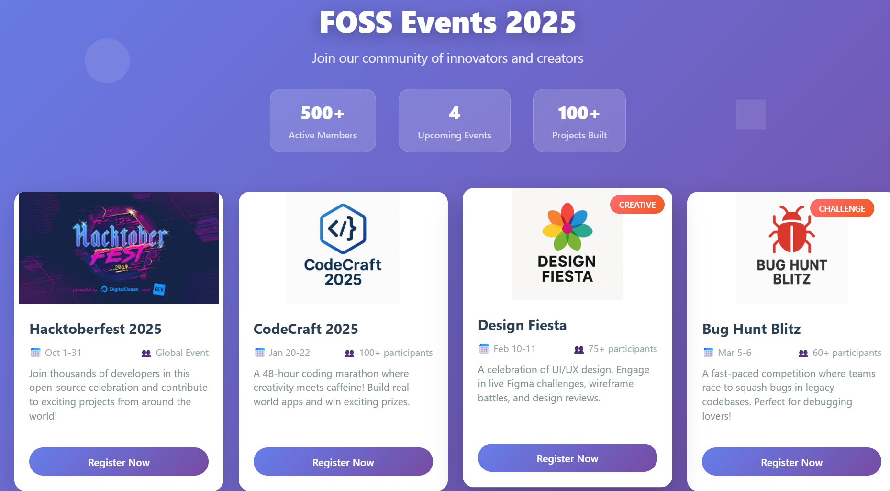

# FOSS-SELECTION-2025

A responsive multi-event website built for the Tech Team Challenge 2025 by FOSS Club, LBSITW.

🔗 **Live Demo:** [Click here to view the website](https://deboraht07.github.io/FOSS-SELECTION-2025/)


## 📌 Overview

This project enhances the base template by adding 3 custom events along with Hacktoberfest 2025. Each event includes its own dedicated page with an engaging layout, glowing UI, responsive design, and interactive registration.

## ✨ Features

- Responsive homepage with animated event cards  
- Dedicated pages for each event  
- CSS Grid-based image galleries with hover effects  
- Motivational quotes, skills gained, and event info  
- Glowing logos, buttons, and neon-style theming  
- Fully mobile-friendly and accessible design

##  📸 screenshots 




## 📌 Events Included

- **Hacktoberfest 2025** – Open-source celebration  
- **CodeCraft 2025** – 48-hour coding marathon  
- **Design Fiesta** – UI/UX design showcase  
- **Bug Hunt Blitz** – Fast-paced debugging competition

## 🛠️ Technologies Used

- HTML5  
- CSS3 (Flexbox, Grid, custom variables)  
- JavaScript (basic interactions)  
- Google Fonts: Space Grotesk & Poppins

## 📁 Project Structure

index.html → Homepage
code.html → CodeCraft 2025
design.html → Design Fiesta
bug.html → Bug Hunt Blitz
assets/ → Logos, banners, screenshots


## 🙋‍♀️ Submitted By

**Deborah T.**  
GitHub: [@deboraht07](https://github.com/deboraht07)

---

## ⚙️ Workflow: How to Clone and Contribute

### 1⃣ Fork the Repository
Navigate to the official repository.  
Click the **Fork** button in the top-right corner to create a copy under your GitHub account.

### 2⃣ Clone to Your Local System

Open your terminal and run:

```bash
git clone https://github.com/your-username/FOSS-SELECTION-2025.git
cd FOSS-SELECTION-2025

 
